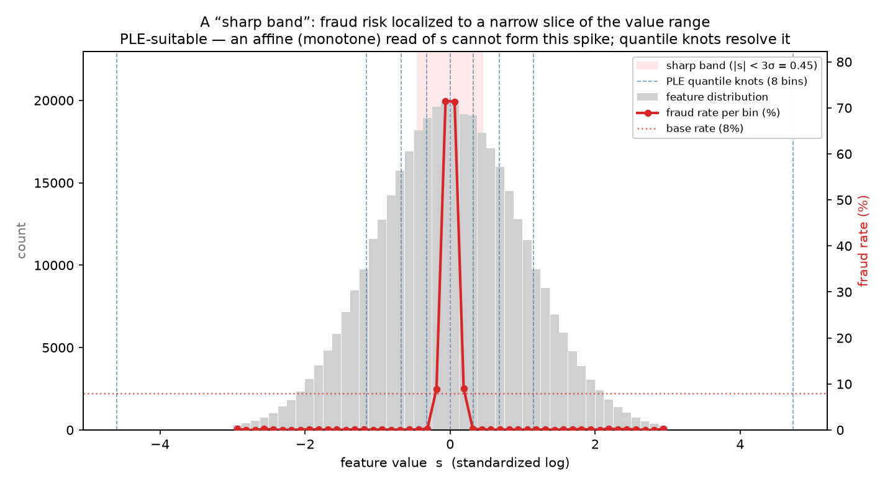
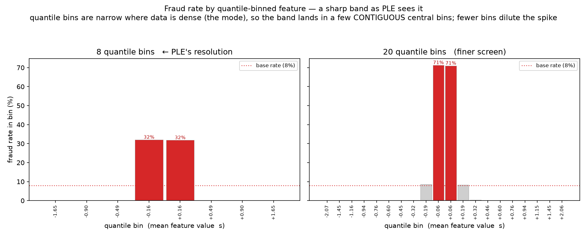
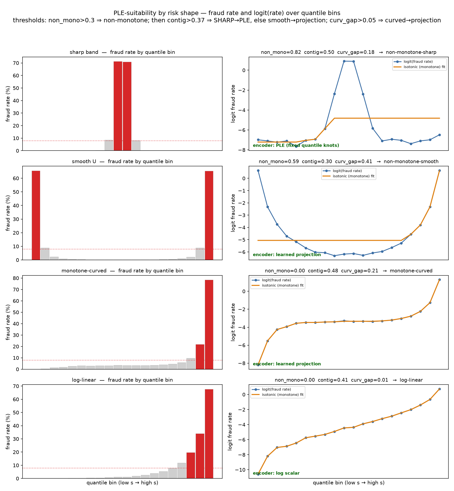

# When is PLE worth it over `log`/`raw` for an affine-input GRU?

A per-feature decision protocol distilled from the numeric-encoding-capacity line (cycles 1–8). The
question it answers: **for a given per-step numeric feature entering an affine-read sequence model, will a
piecewise-linear encoding (PLE) beat a `log` scalar (or `raw`)?**

The one-line law the whole line converges on:

> **A fixed numeric basis (PLE) beats `log` iff (1) the model has no free per-step nonlinearity to rebuild
> the shape, (2) the feature set's per-step risk carries a lever the affine read can't form — curvature
> *or* non-monotonicity, visible only *multivariate* — and (3) that lever, summed over encoded features,
> exceeds PLE's dimensionality deficit, which in a GRU is large (~−0.13 for 6 features × 12 bins).** An
> affine GRU satisfies (1) structurally; (2) and (3) must be checked, and PLE's deficit is often the binding
> constraint.

Run the gates in order. Each is cheaper than the next, and a failure at any gate means **keep `log`** — do
not proceed. Most features stop at Gate C; the deficit (Gate D) is what most often kills an otherwise-real
lever.

## Evidence basis (read before trusting any number below)

Every quantitative result in this protocol comes from **controlled synthetic experiments** (`*.py` in
`experiments/gru_curvature_realdata/`), each with a firing static positive control. Synthetic is a
*feature here, not a limitation*: because the per-step risk shape is constructed, a measured encoding
effect is **causal and mechanism-isolating** — it cannot be a spurious correlation with an unobserved
covariate the way a real-data result can. What that buys, and what it doesn't:

- **Established (transferable, treat as settled):** the *mechanism* and *direction* — **which variable
  governs** the outcome (target **sharpness**; PLE's **dimensionality deficit**; the **multivariate**
  visibility requirement) and the **sign** of each effect. These are the load-bearing claims.
- **Not established (do not deploy on):** whether a *particular real feature* actually has the shape in
  question, or the *magnitude* at production scale. Every number below (+0.14, +0.18, ~−0.13, ~+0.45) is a
  **directional PoC value** (L=32, 5–8 seeds), not a deployment figure.
- **The bridge:** the real-data A/B (Cycle 6) tests whether these mechanisms are *present in real features*
  and at what magnitude. Status: **precondition-gate step only — no real-data encoder comparison exists
  yet.**

Read the governing variables as settled; read every magnitude as "sign and rough scale under controlled
conditions."

---

## Illustrations — recognizing the shapes (synthetic)

These figures make the shape vocabulary concrete. Regenerate them (and the per-shape metrics) with `uv run figures/ple_suitability_figures.py`; all use the consolidated flow's own risk-shape DGP on a standardized-log feature $s$.

**A "sharp band" — the PLE-suitable case.** Fraud log-odds is a narrow localized bump ($\exp(-s^2/2\sigma^2)$, $\sigma = 0.15$): risk is $\approx 0$ across the whole value range except a thin slice where it spikes. An affine (monotone) read of $s$ cannot form a low-then-high-then-low shape; PLE's quantile knots can.



**The same band as PLE sees it (quantile bins).** Because quantile bins are narrow where data is dense (the mode), the band lands in a few contiguous central bins. Note the resolution/deficit tradeoff: 8 bins (PLE's default) dilute the in-band rate to $\approx 32\%$; 20 bins resolve it to $\approx 71\%$. Bin width must approach band width to capture the lever, and more bins cost more deficit.



**Telling the four shapes apart.** The screen bins by quantile and reads $\operatorname{logit}(\text{fraud rate})$ (removing the sigmoid link), then thresholds: `non_mono` $= 1 - R^2_{\text{isotonic}}$, `contig` $=$ fraction of excess-risk mass in the largest contiguous run, `curv_gap` $= R^2_{\text{isotonic}} - R^2_{\text{linear}}$. A **sharp band** is non-monotone with one contiguous elevated run (`non_mono` high, `contig` high) → **PLE**. A **smooth U** is non-monotone but elevated at *both* ends (`contig` low) → **learned projection**. **Monotone-curved** and **log-linear** are monotone (`non_mono` $\approx 0$), split by `curv_gap`: curved → projection, straight → keep the `log` scalar.



---

## Gate A — Architecture precondition (static check, once per model)

**A1. Is the per-step numeric path truly affine?** Confirm numerics enter the recurrence as `W·x_t` with
**no per-step Dense/MLP/ReLU** before the RNN cell.
- *Pass:* no per-step nonlinear projection → a basis can be decisive.
- *Fail (a per-step MLP exists):* **STOP for all features.** The model rebuilds any 1-D transform itself;
  PLE is redundant (Cycle 5: PLE ties `log` in every free-nonlinearity model). If a per-step Dense is
  ever added to production, this whole protocol becomes moot.

---

## Gate B — Instrument preconditions (does the encoding question even apply?)

These fix the exact failure that made Cycle 3 uninterpretable. Run once for the model; B3 is per feature.

**B1. The sequence model beats a strong tabular baseline.** Train the GRU (`log` arm) and a **strong**
tabular model — GBM on **recency/EWMA-weighted** aggregates matching the account's decay, not just
mean/std/last. A recency-agnostic baseline passes the gate too cheaply.
- *Pass:* `AP(GRU) − AP(tabular)` seed-level CI-clear > 0.
- *Fail:* the sequence model adds nothing here → per-step encoding of history is moot.

**B2. The model uses temporal order.** Shuffle the prior steps of the **test** sequences, re-score with the
**same** trained model.
- *Pass:* PR-AUC drop CI-clear > 0. (Cycle 8 synthetic: +0.236.)
- *Fail (~0 drop):* order carries no signal → nothing for per-step history encoding to exploit.

**B3. The feature is informative.** An encoding cannot lift a no-signal feature (Cycle 4's vacuous null).
- *Pass:* feature-only fraud signal CI-clear above base — production **SHAP importance** is the best
  proxy; a feature-alone AP or mutual-information screen also works.
- *Fail:* skip the feature. (Cycle 4 lesson: this is a HARD GATE, not a footnote.)

---

## Gate C — Is there a per-step lever, and does it clear PLE's deficit? (Cycle 7 + 8, corrected)

> **Correction.** An earlier version of this gate said "in a GRU, monotone curvature is absorbed by the
> gates → keep `log`." That was **wrong** (it came from a single-feature experiment where curvature is
> invisible under a rank metric). The corrected finding: **both curvature and non-monotonicity ARE per-step
> levers in an affine GRU** — but the lever only appears in a **multivariate** design and only survives
> **net of PLE's dimensionality deficit**, which in a GRU is large.

**Two things must both be true for PLE to beat `log` in an affine GRU:** (1) the feature set carries a
per-step lever the affine read can't form on its own — *multivariate*, and (2) that lever, summed over the
encoded features, **exceeds the encoder's dimensionality deficit**. Measured wrong, either can hide the
other — the trap that made Cycle 8's first pass conclude the opposite of the truth.

**Which shapes are levers (an affine GRU's gates are smooth approximators, so only *localized* structure is
a lever):** sharp/localized non-monotone (**strongest**, deficit-corrected ~+0.45) ≫ monotone curvature
(**moderate**, ~+0.14) ≫ smooth non-monotone (**absorbed by the gates**, ~0) ≈ log-linear (none). Target
sharp or sharply-curved features; do not spend encoding on smooth non-monotone (a broad U/inverted-U) — the
gates already handle it.

**The deficit is usually the binding constraint, and it confines the raw net-win to a narrow ridge.** For
fixed PLE, raw `ple−log > 0` held at only one config in a K×bins sweep (K≈4, bins≈8, +0.047); more bins or
features push it negative. **Encoder choice depends on the target's sharpness (C3):** a learned per-feature
embed pays less deficit and wins on *smooth/curved* targets, while *fixed PLE* wins decisively on
*sharp/localized* targets (SGD can't place sharp knots; PLE's quantile knots resolve them for free).

**C1. Screen: empirical risk-vs-value shape (necessary, not sufficient).** Bin the feature by percentile,
plot empirical fraud rate per bin, fit an isotonic regression; the non-monotone fraction is `1 − R²_iso`.
A curved-monotone or non-monotone shape is a *candidate*; a purely log-linear shape is not. **But shape
alone does not decide** — curvature is invisible in isolation and only surfaces multivariate (C2), and the
benefit still has to clear the deficit (D). Treat C1 as a cheap filter that only *rejects* log-linear
features.

**C2. Multivariate positive-controlled probe (decisive).** The single reliable test, and the one that must
not be skipped after Cycle 8:
- Build a **multivariate** synthetic mirror of the candidate feature set (K features, additive risk) — a
  single feature cannot express curvature under a rank metric.
- Run the **deficit-aware** estimand `Δ = (ple−log)_target − (ple−log)_log-adequate` (Gate D) in the target
  architecture.
- **Include a static-head positive control on the same features.** If `Δ_static` does not fire CI-positive,
  your instrument is blind and *no* conclusion (positive or null) is trustworthy — halt and fix the design
  before reading the GRU. (This is exactly the check whose absence made Cycle 8's first verdict wrong;
  when added, static curved fired +0.015 and the GRU lever appeared at +0.143.)
- A free-nonlinearity `mlp`/`dense` arm remains a useful corroborator ("does *any* per-step transform help"),
  but it too must be run multivariate — single-feature `dense`/`mlp` numbers are in the invisible regime.

**C3. Fixed PLE vs a learned per-feature embed — RESOLVED: the choice flips on TARGET SHARPNESS.** Two
multivariate, shared-coordinate, 8-seed, Holm-corrected reruns settle it:
- **Smooth target (monotone curvature) → learned embed wins** (`fixed_vs_learned.py`): the
  `Linear(1→d)→ReLU` embed beats PLE by +0.094 (Holm-sig). Both unlock the same lever (deficit-corrected
  +0.137 vs +0.148); PLE loses because it pays a **larger dimensionality deficit** (its `d` ramps all fire
  and load the recurrence) while the learned embed shapes its outputs at lower effective cost, and a smooth
  monotone transform is easy for SGD to learn.
- **Sharp target (localized non-monotone) → fixed PLE wins, decisively** (`nonmono_encoders.py`, *synthetic
  Gaussian bands, L=32 PoC, 8 seeds*): PLE beats the learned embed by **+0.11 to +0.18 (Holm-sig)** at
  *both* of the two band locations tested (at-mode and off-mode s₀=1.5) — evidence of robustness to
  location, not a full sweep. The learned embed loses because SGD **cannot reliably place sharp ReLU knots**
  on a narrow band (dead-ReLU / slow-migration), whereas PLE's fixed quantile knots blanket the range and
  resolve the band for free — a *mechanism* result, so the direction (sharp → PLE) transfers even though the
  magnitude is a PoC value. Since sharp non-monotone is the *strongest* lever (~+0.45), PLE is the right
  tool exactly where encoding matters most. Whether real count/ratio features actually carry sharp-band
  risk is a Gate-C1 question on real data, not settled here.

**Rule:** smooth/curved → learned per-feature embed; sharp/localized/non-monotone → fixed PLE.

> This reconciles the retracted single-feature "PLE wins on sharp" claim: the retraction was methodologically
> right (that evidence was confounded — coordinates, mode-pinning, n=5), but the *direction* is confirmed
> once tested properly. Kill bad evidence even when the conclusion later survives on good evidence.

---

## Gate D — Deficit-aware confirmation A/B (only if C passes)

PLE pays a structural ~−0.03/−0.04 deficit wherever `log` is adequate (Cycle 7). Measure the benefit **net
of that deficit**, or you will understate it and wrongly reject.

**D1. Deficit-aware estimand.** Do **not** read raw `ple − log`. Use a difference-of-differences against a
**log-adequate, marginal-matched reference feature**: `Δ = (ple − log)_target − (ple − log)_reference`. The
reference must be exactly log-adequate *and* share the target's marginal shape (Cycle 8 F4 — `amount` was a
contaminated reference: weakly curved AND marginal-mismatched).

**D2. Magnitude-sensitive metric alongside PR-AUC.** Report **log-loss / Brier** too. PR-AUC is
rank-invariant, so it can hide a representational change; if PR-AUC and Brier disagree, trust the pair, not
PR-AUC alone (Cycle 8 F2).

**D3. Oracle ceiling + static-head positive control.** Compute an oracle (rank by true risk if synthetic),
and — the non-negotiable check from Cycle 8 — run the identical estimand on a **static affine-read head**
where the lever is *known* to exist. If the static positive control does not fire CI-positive, the
instrument is blind and neither a positive nor a null GRU result is trustworthy. (An oracle gap alone does
**not** license "not encoding-addressable" — that inference was the retracted error; only a firing positive
control distinguishes "no lever" from "blind estimand.")

**D4. Adoption bar.** Seed-level paired-t **95% CI** on the deficit-corrected `Δ` (+ Holm across a feature
family). Adopt PLE only if the **CI excludes 0 positive**. Within ±0.005 = tie → keep `log` (simpler, no
moving parts).

---

## Gate E — Training-hygiene guards (against a false negative)

PLE-in-GRU is training-sensitive; an under-resourced run shows a **spurious negative** lift (the un-hardened
Cycle 8 PoC's −0.19 was pure undertraining, not representation).

- **E1. Optimize like production:** minibatch + per-epoch reshuffle, adequate epochs, held-out validation
  with early-stopping + **best-state restore**, sufficient hidden width. (Cycle 6/8 regime.)
- **E2. Few bins:** ~8–12; more adds variance and serving width with no benefit. Fit bin edges on **train
  only**; refit on drift (`log` has no moving part — count this as an ongoing cost).
- **E3. Sanity-check the deficit:** run PLE on a known-log-adequate control; you should recover a stable
  deficit — **but expect it to be large in a GRU** (~−0.13 for 6 features × 12 bins, vs ~−0.03 in a static
  head). This deficit is usually the binding constraint on net deployment value, not the lever; measure it
  explicitly per (K, bins) rather than assuming the small static figure.

---

## Decision flow (summary)

```
A1 affine read? ───no──► keep log (PLE redundant; Cycle 5)
   │ yes
B1 GRU beats strong tabular? ─no─► encoding moot
B2 uses temporal order?      ─no─► encoding moot
B3 feature informative (SHAP)?─no─► skip feature (Cycle 4)
   │ all yes
C1 risk-vs-value log-linear? ──yes──► keep log (no lever to find)
   │ curved or non-monotone
C2 MULTIVARIATE deficit-corrected Δ, static positive control fires?
   │ yes (lever real + instrument valid)      │ no / control blind ─► keep log / fix design
D  does the lever CLEAR PLE's deficit? (Δ CI-excludes-0 net of ~−0.13 GRU cost, Brier agrees)
   │ yes                          │ no / tie  ◄── the deficit usually binds here
   ▼                              ▼
adopt PLE (few features, few bins;   keep log
verify prod A/B)  (guard E1–E3)
```

## What this predicts for the production features

- **amount** — its risk is likely close to log-adequate (null across cycles), so even if a small curvature
  lever exists it is unlikely to clear PLE's GRU deficit → **probably keep `log`** (confirm via C2/D, not by
  assuming "monotone ⇒ no lever," which was the retracted error).
- **Δt (inter-transaction time)** — plausibly non-monotone (short = card-testing, long =
  dormant-reactivation) → **the strongest PLE candidate**; run the full multivariate D confirmation.
- **counts / recency aggregates** — genuine candidates (curvature *is* a lever now), but each must clear the
  deficit; encode only the few strongest at few bins.

Resolved by the Cycle 8 follow-up experiments: the **deficit-vs-(K, bins)** ridge (raw net-win only at
K≈4/bins≈8), the **sharp-vs-smooth** anomaly (GRU absorbs smooth, sharp fires +0.45), and **fixed-vs-learned**
(prefer the learned embed). The only external item left open is **Cycle 6's real-data A/B**, now runnable
with the validated precondition gate and the targeting rule above (few sharp/curved features, low width,
learned per-feature embed).
