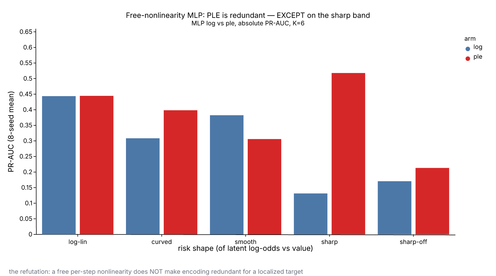
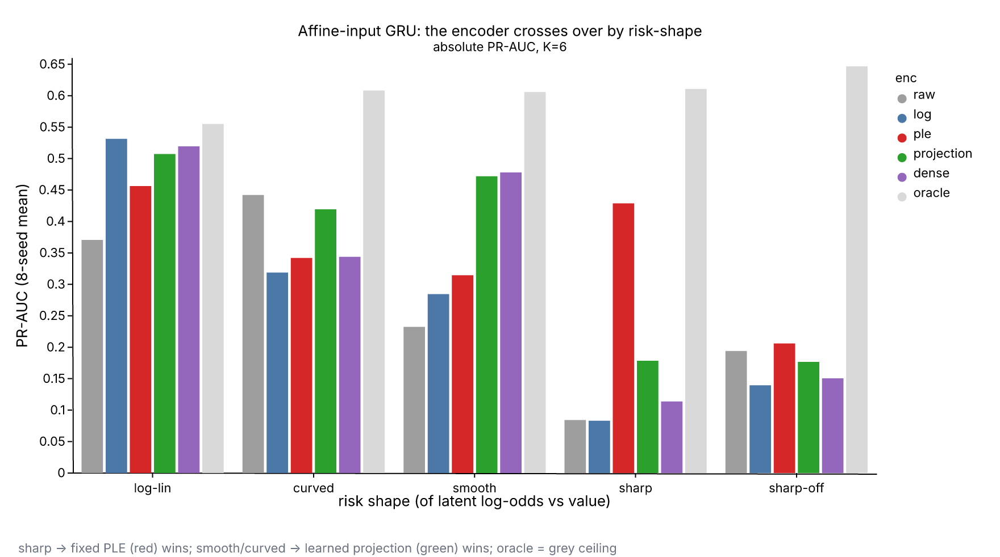
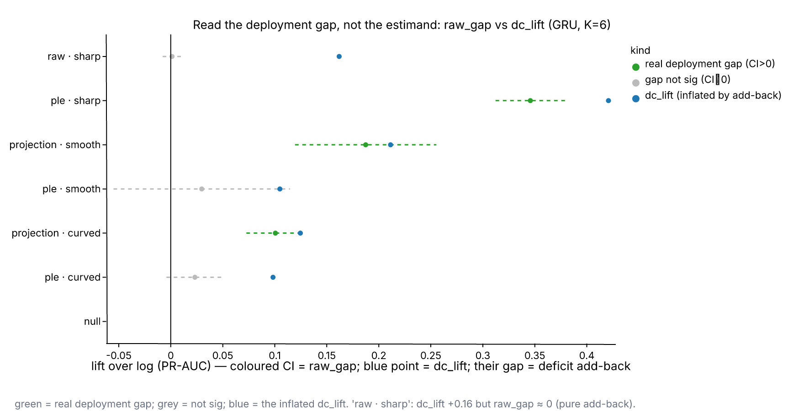

# When Does a Numeric Encoding Help? A Localization Account (consolidated synthetic study)

> **Consolidated revision.** This supersedes `../encoding_capacity_synthesis/REPORT.md`, which read two separate experiments (a static MLP on a smooth $\Delta t$, and an affine-read GRU) and concluded a richer encoding helps *iff the model lacks a free per-feature nonlinearity*. Putting all three architectures (static / GRU / MLP) on one footing across five risk shapes — and, decisively, testing a **sharp** target on the free-nonlinearity MLP, which the prior studies never did — refutes that architecture law. The corrected account is localization, not architecture. Source: one Metaflow flow (`flow/flow.py`), run `ConsolidatedFlow/1784135301155957`, 8 seeds, dual positive-controlled, every arm temperature-calibrated. Every number below is read from that run's `aggregate_results` / `lift_results`.

## Abstract

Across five encoding arms (`raw`, `log`, `ple` = quantile piecewise-linear, `projection`/`dense` = learned per-feature nonlinear expansions), whether a basis beats a plain `log` transform is governed — in these experiments — not by whether the model applies a free nonlinearity to the feature, but by whether the target's risk-vs-value shape is **localized (sharp)**. One controlled synthetic flow crosses architecture (static affine-read / GRU affine-read / free-nonlinearity MLP) with five risk shapes (log-linear, monotone-curved, smooth non-monotone, and two sharp bands), at multiplicity $K \in \{1, 6\}$, over 8 seeds, judged by PR-AUC with seed-level paired-t 95% CIs and Holm. Three results stand out. (1) A free-nonlinearity MLP — which the prior account predicted would make encoding redundant — still gains **+0.39 raw PR-AUC** from PLE on the sharp band (`mlp_log` 0.13 → `mlp_ple` 0.52, near the 0.61 oracle), while encoding is genuinely redundant or harmful for it on smooth/curved shapes. (2) In the affine-read GRU, the best encoder crosses over by shape: **fixed PLE for sharp** (raw +0.35 over `log`, $\gg$ a learned projection's +0.10), **learned projection for smooth/curved** (raw +0.19 / +0.10, $\gg$ PLE's +0.03 / +0.02). (3) The deficit-corrected difference-of-differences estimand equals `raw_gap + |log_linear_deficit|`, so weak or mis-conditioned arms post large "lifts" that are pure add-back; every effect here is therefore reported with its raw deployment gap. The mechanism section proposes a two-factor account consistent with all three; Limitations state what it does and does not establish.

## The proposed mechanism (revised)

A model consumes a scalar $x$ through a per-feature map $e(x)$ and then does something with the result. Whether a richer $e$ (`ple`, `projection`, `dense`) beats `log` depends on **two independent obstacles**, either of which a basis can relieve:

- **Obstacle 1 — affine-read limitation.** A GRU (and the static logistic head) reads each per-step input only as $W \cdot e(x_t)$ before a fixed sigmoid/tanh; it applies no free nonlinear network to $x_t$ alone. The per-step function class *is* the span of the encoding, so a richer $e$ widens it. This makes a basis help the affine-read models on **any** non-log-linear shape (smooth, curved, sharp).
- **Obstacle 2 — optimization-hardness of a localized target.** A free-nonlinearity model (an MLP on the scalar) *can represent* any 1-D shape, so the prior account expected it never to need a basis. But representation is not optimization: a razor-sharp localized bump ($\exp\!\big(-(s-\mu)^2/2\sigma^2\big)$, $\sigma \approx 0.15$) is very hard to **find** by SGD from a scalar. A fixed quantile basis hands the model that localization for free. This makes a basis help **even a free-nonlinearity model** — but only for a **sharp** target; smooth/curved shapes are SGD-learnable, so there the MLP needs no basis.

The old "free-nonlinearity ⇒ redundant" law is the special case of this account where Obstacle 2 is absent — i.e. it holds for smooth/curved targets and fails for sharp ones. The prior studies only ever put a *smooth* $\Delta t$ in front of the MLP, so they never triggered Obstacle 2.

**Predictions (tested below).** Affine-read models: a basis beats `log` on every non-log-linear shape. Free-nonlinearity MLP: a basis is redundant on smooth/curved but **helps on sharp**. Encoder choice within the affine GRU: **fixed PLE where the target is sharp** (SGD cannot place sharp ReLU knots; PLE's quantile knots resolve them), **learned projection where the target is smooth/curved** (SGD-learnable, and a projection pays a smaller dimensionality deficit than a wide PLE basis).

## Result 1 — the free-nonlinearity model is NOT uniformly redundant (the refutation)

The `mlp` arm is a genuine free-nonlinearity model: a 2-layer (width 64) per-step MLP, recency-pooled with the true weights, trained to convergence. Its `log_linear` deficit is $\approx 0$ (`mlp_ple` 0.4447 $\approx$ `mlp_log` 0.4436), so the arm fits the reference — the confound that made the earlier undercapacity floor collapse is gone. PLE vs `log` on the MLP, by risk shape (K=6, 8-seed mean, raw PR-AUC and the raw gap):

| risk shape | `mlp_log` | `mlp_ple` | raw gap (ple − log) | reading |
|---|---|---|---|---|
| log-linear | 0.444 | 0.445 | +0.001 | redundant |
| monotone-curved | 0.308 | 0.398 | +0.090 (CI touches 0) | ~redundant |
| smooth non-monotone | 0.382 | 0.306 | **−0.076** | PLE *hurts* (MLP already forms it) |
| **sharp (mode)** | 0.132 | 0.518 | **+0.387** (Holm-sig) | PLE **decisive** |
| sharp (off) | 0.171 | 0.213 | +0.043 | small |

The MLP learns the smooth and curved shapes from the scalar (a basis is redundant, and a full PLE basis is harmful on smooth), exactly as the prior account predicted. But on the sharp band it collapses to 0.13 — and so does `gru_log` (0.083) — while `mlp_ple` reaches 0.52. The MLP trains fine everywhere else, so this is not undercapacity; a $\sigma \approx 0.15$ localized target is simply not found by SGD from a scalar. **This is the refutation:** a free per-step nonlinearity does not make encoding redundant; localization does.

*Figure 1. PLE vs `log` on the free-nonlinearity MLP (K=6, 8-seed mean). Redundant on log-linear, harmful on smooth, and decisive on the sharp band (0.13 → 0.52) — the localization refutation of the architecture law.*

## Result 2 — the affine-read models, and the fixed-vs-learned crossover

Four/five-way absolute PR-AUC in the affine-read GRU (K=6, 8-seed mean; oracle = rank by true log-odds):

| risk shape | `raw` | `log` | `ple` | `projection` | `dense` | oracle | winner |
|---|---|---|---|---|---|---|---|
| log-linear | 0.371 | **0.531** | 0.456 | 0.507 | 0.520 | 0.555 | `log` (encoders pay deficit) |
| monotone-curved | 0.442 | 0.319 | 0.342 | **0.419** | 0.344 | 0.608 | `projection` |
| smooth non-monotone | 0.233 | 0.285 | 0.314 | 0.472 | **0.478** | 0.606 | `dense` $\approx$ `projection` |
| **sharp (mode)** | 0.084 | 0.083 | **0.429** | 0.179 | 0.114 | 0.611 | **`ple`** |
| sharp (off) | 0.194 | 0.140 | **0.206** | 0.177 | 0.151 | 0.647 | `ple` |

The crossover is unambiguous — the encoder that wins depends on the target's sharpness (raw gap over `log`, K=6):

| risk shape | `ple − log` | `projection − log` | best encoder |
|---|---|---|---|
| sharp (mode) | **+0.346** | +0.096 | **fixed PLE** ($\gg$ projection) |
| sharp (off) | **+0.067** | +0.037 | fixed PLE |
| smooth non-monotone | +0.030 (n.s.) | **+0.187** | **learned projection** ($\gg$ PLE) |
| monotone-curved | +0.023 (n.s.) | **+0.101** | learned projection |

*Figure 2. Absolute PR-AUC in the affine-read GRU (K=6, 8-seed mean). Fixed PLE (red) towers on the sharp band where every other arm collapses; the learned projection (green) leads on smooth and curved; `log` (blue) wins only on log-linear. Oracle (grey) is the ceiling.*

Fixed PLE wins where the target is sharp; a learned projection wins where it is smooth/curved. Conditioning is a separate axis and persists: on `log_linear`, `log` (0.531) beats `raw` (0.371) by +0.16 — a heavy-tailed raw value fed straight into an affine recurrence is badly conditioned regardless of shape. The static affine-read head reproduces the sharp lever as a deterministic positive control (`static_ple` sharp +0.414 raw), and shows curvature is **not** a static-affine lever (`static_ple` curved −0.065) — curvature is delivered specifically by the GRU's learned projection.

## Result 3 — read every lift next to its raw gap (the estimand caution)

The deficit-corrected estimand `dc_lift = (arm − log)_condition − (arm − log)_log_linear` equals `raw_gap − deficit` (deficit usually $\le 0$), so an arm that fails the `log_linear` reference has a large `|deficit|` added back to it on every other condition. Illustrative rows (K=6):

| arm · condition | dc_lift | raw_gap | reading |
|---|---|---|---|
| `gru_raw` · sharp | +0.162 (Holm-sig) | **+0.001** | entirely add-back — raw ties `log` |
| `gru_ple` · curved | +0.098 (Holm-sig) | +0.023 (n.s.) | ~83% add-back |
| `gru_ple` · sharp | +0.421 (Holm-sig) | **+0.346** | real |
| `gru_projection` · smooth | +0.211 (Holm-sig) | **+0.187** | real |

The estimand is the right *structural* quantity (it nets the fixed dimensionality tax), but it is not an effect size. The flow now emits `raw_gap` beside every `dc_lift`; read magnitude from `raw_gap`.

*Figure 3. For six illustrative GRU arms (K=6): the coloured interval is `raw_gap` with its 95% CI (green = real deployment gap, grey = not significant); the blue point is `dc_lift`. The horizontal gap between them is the deficit add-back. `raw · sharp` is the cautionary case — `dc_lift` +0.16 on a `raw_gap` of $\approx 0$.*

## Synthesis

| model | what a basis relieves | where a basis helps |
|---|---|---|
| free-nonlinearity MLP | Obstacle 2 only | **sharp only** (`+0.39`); redundant/harmful on smooth/curved |
| affine-read GRU / static | Obstacles 1 **and** 2 | every non-log-linear shape; encoder by sharpness |

A single account fits all three: a basis helps when the model cannot **form** the shape (affine read) *or* cannot **find** it by SGD (a localized target). Sharp non-monotonicity triggers both, which is why it is the largest and most universal lever (it helps even the MLP). Smooth/curved trigger only the affine-read obstacle, which is why they help the GRU but not the MLP. And where a basis helps the GRU, the *kind* matters: a fixed quantile basis dominates for sharp targets (no knots to learn), a learned projection dominates for smooth ones (SGD-learnable, smaller deficit). The multiplicity contrast confirms the curvature lever is not purely a many-feature effect: `gru_projection` beats `log` on curved even at K=1 (0.245 vs 0.202, raw +0.042).

**Two caveats on strength, flagged here not only in Limitations.** The cross-architecture contrast is not a single-variable manipulation; the cleanest within-model evidence is (a) the GRU `projection`/`dense` arms, which add a free per-step nonlinearity to the *same* model and beat `log` on smooth/curved, and (b) the MLP sharp result, which holds architecture fixed and varies only the target's sharpness. All results are synthetic: they bound the *direction* of effects, not their size on real data.

## Limitations

- **Mechanism is a proposed explanation, not proven.** It is consistent with all three architectures and both within-model controls, but one synthetic flow does not establish it as general.
- **Synthetic; magnitudes are direction-only.** Signals are informative by construction with dual positive controls and a precondition comparator; the real-data test is an A/B on the reference model. On the demo account-sequence data the precondition failed (task was point-in-time), so no real magnitude is claimed — see `../gru_curvature_realdata/REAL_DATA_AB.md`.
- **The sharp result depends on a constructed band.** A localized Gaussian band is exactly where a fixed basis is expected to help; whether real amount/$\Delta t$-in-context resemble it is unknown here.
- **PLE is training-sensitive.** Many correlated bins into a recurrent input were unstable in an under-resourced run (a first flow gave a spurious negative). The reported run used real capacity, a 120-epoch cap with validation early-stopping, gradient clipping, and best-state restore.
- **`nondeterministic` contract.** Torch CPU GRU kernels are not bit-reproducible; the 8-seed CIs (not exact aggregates) are the reproducibility guarantee. `--max-workers` is a speed knob only.

## Recommendation

For a fraud sequence GRU that reads per-step `log`-scalar amount and $\Delta t$ directly into the recurrence (no per-step projection): **encode by the shape of the feature's risk-in-context, not by its curvature-vs-linearity.** PLE the features whose risk is **sharp / localized non-monotone** ($\Delta t$ is the leading candidate — short = card-testing, long = dormant-reactivation → a localized band); use a **learned per-step projection** for features whose risk is **smooth non-monotone or curved**; and leave **monotone / log-adequate** features (amount) on the `log` scalar, where a basis only imports the dimensionality deficit. Validate with a production A/B over `log` / `ple` / `projection`, seed-level CI-excludes-zero bar, adequate capacity/epochs for the PLE arm, treating the synthetic magnitudes as direction-only. Note that a free per-step nonlinearity does **not** exempt a sharp feature from needing a basis — if the sharp lever matters, PLE helps even after you add a per-step projection.

## Artifacts

- Flow: `flow/flow.py` (seams: `make_data`, `build_model`, `train_arm` registry, `metric`); Hydra `flow/conf/`.
- Run: `ConsolidatedFlow/1784135301155957` — read `aggregate_results` (absolute PR-AUC), `lift_results` (`dc_lift` + `raw_gap` + `deficit`, Holm), `analyses` (`an_controls` gate, `an_calibration`).
- Figures (this folder, regenerated from the run artifacts by `ferrum_figs.py`, ferrum-viz): `fig1_gru_crossover_prauc.png`, `fig2_mlp_refutation.png`, `fig3_rawgap_vs_dc.png`. `uv run ferrum_figs.py` to rebuild.
- Operational companion report: `CONSOLIDATED_REPORT.md`; claim→arm map: `CLAIMS.md`; pre-registration: `HYPOTHESIS.md`. Superseded prior synthesis: `../encoding_capacity_synthesis/REPORT.md`.
- Gates: `flow-lint` (clean) · `pipeline-reviewer` fidelity (4/5 PASS, 1 non-blocking naming CONCERN addressed) · determinism `nondeterministic`. Peer review: `research-reviewer` REFRAME → addressed.

## Appendix: Methods

### Synthetic generator (`make_data`)

Per-cell: $K \in \{1, 6\}$ i.i.d. lognormal per-step features over a sequence, additive equal-weight risk, one fixed label DGP across train/val/test (standardization, risk-normalization, and intercept all fit on **train** so the label generator is identical across splits). Five risk shapes over the standardized log coordinate $s$: log-linear ($s$), monotone-curved ($s^3$), smooth non-monotone ($s^2$), and two sharp bands ($\exp\!\big(-(s-\text{offset})^2/2\sigma^2\big)$, $\sigma = 0.15$, offset 0 = `sharp_mode`, 1.5 = `sharp_off`). Recency-weighted aggregation (leaky decay); intercept bisected to a ~0.08 realized positive rate. Splits: train/val/test per cell, regenerated per seed.

### Encodings and architectures

`raw` = train-standardized raw value; `log` = standardized `log1p` (the reference scalar); `ple` = 8 quantile bins on the standardized-log coordinate (train-fit, clip-interpolated); `projection` = per-feature `Linear(1→8)→ReLU` inside the model on the same log coordinate; `dense` = a joint per-step `Linear→ReLU`. PLE and projection are matched-dimension (8). Architectures: `static` = deterministic logistic regression on the recency-pooled encoding (affine read, used for the positive control); `gru` = affine-input GRU (hidden 64); `mlp` = 2-layer width-64 per-step MLP, recency-pooled (the free-nonlinearity model). `oracle` (rank by true log-odds) and `tabular` (GBM on last/mean/std/EWMA aggregates) bound the ceiling and the precondition.

### Statistics, calibration, controls

Metric: PR-AUC (average precision) on raw scores; log-loss/Brier on **temperature-calibrated** probabilities so magnitude metrics reflect representation, not calibration. Every arm is temperature-scaled on validation before magnitude metrics. Decision estimand: seed-paired deficit-corrected lift `dc_lift = (arm − log)_condition − (arm − log)_log_linear`, emitted with its `raw_gap` (the uncorrected `arm − log` on the condition) and `deficit`; 8-seed paired-t 95% CIs with **Holm** across the reported family. **Two positive controls, both hard-halt:** PLE must detect the sharp band in the static path (estimand/label validity) *and* in the trained GRU (`gru_ple`, training-convergence validity). Negative control: `log_linear` (no arm beats `log`). Reported (not gated): curvature detection and the K=1-vs-K=6 multivariate control — the latter returns `False` (static curvature inverts), surfaced honestly rather than gated.
