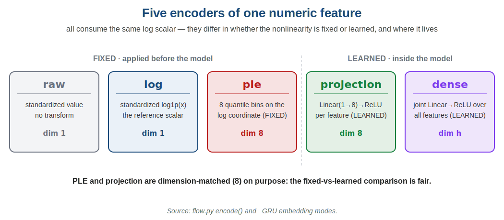
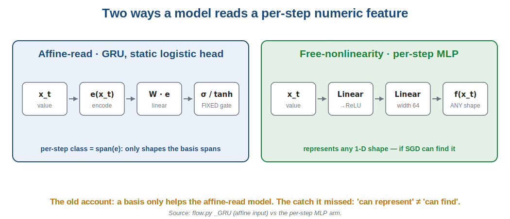
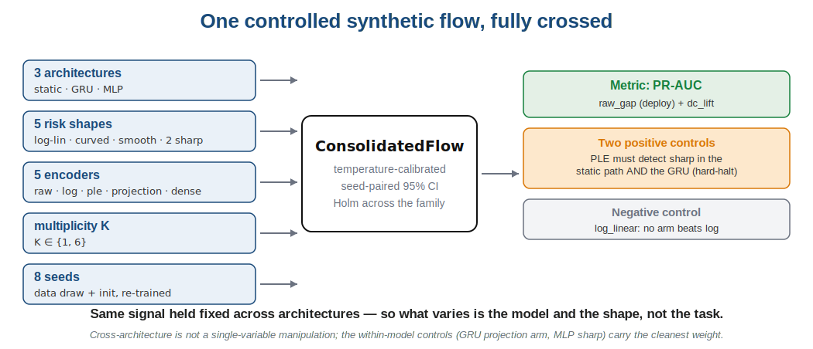
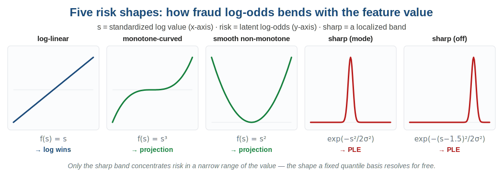
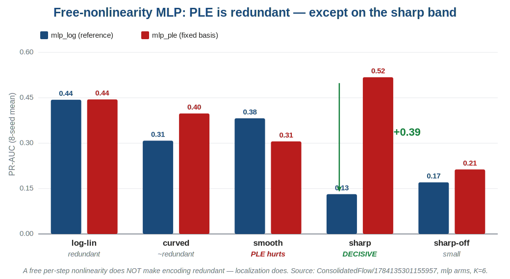
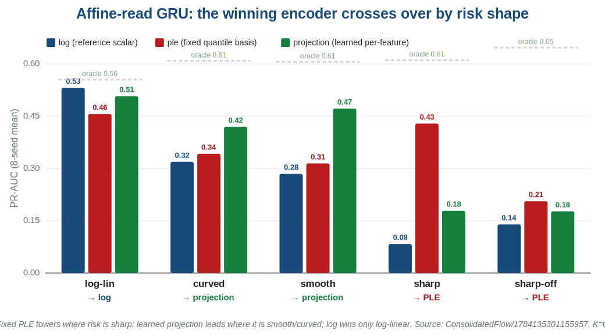
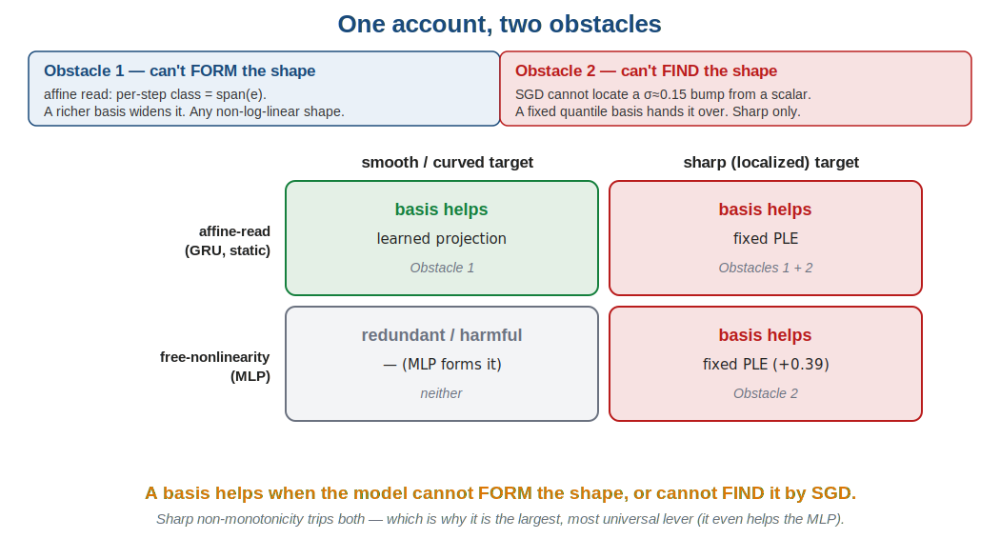
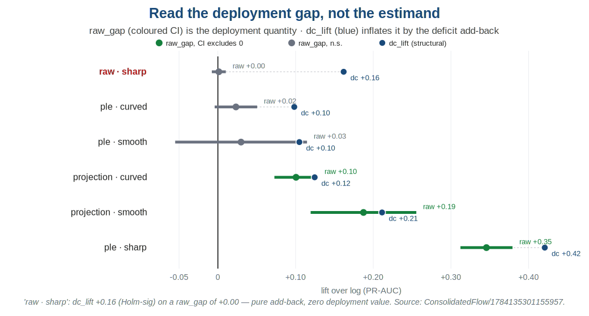

<!-- _class: lead -->

# When does encoding a numeric feature help?

## It tracks the *shape* of the target, not the *type* of the model

A localization account — refuting our own earlier "architecture law"

*numeric-encoding-capacity · experiments/consolidated · ConsolidatedFlow, 8 seeds*

---

## The practitioner's question

You have a numeric feature — a transaction **amount**, a **time-since-last-event** ($\Delta t$). You already `log`-transform it. Should you spend effort on a *richer encoding*?

- A **piecewise-linear encoding** (PLE), a learned projection, a periodic embedding — all cost engineering time and add parameters.
- Sometimes they lift the model meaningfully. Often they are redundant work.
- **The goal of this study:** a rule for *which case you are in*, before you build.

> Short answer: a richer encoding helps when the feature's **risk-vs-value shape is localized (sharp)** — and, for the affine-read case, on any non-log-linear shape. It is redundant when the model can already form or find the shape itself.

---

## Five encoders of one feature

They all read the **same `log` scalar**. What differs is whether the nonlinearity is **fixed** (applied before the model) or **learned** (inside it), and its dimensionality.

---

## Two ways a model reads that feature

**Affine-read** = the model multiplies the encoding by weights and sums, then a *fixed* gate (a GRU cell, a logistic head). **Free-nonlinearity** = a per-step MLP that can bend the scalar into any shape. This distinction was the heart of our first answer.

---

## What we believed going in: the "architecture law"

Two earlier controlled experiments (cycles 5–6) concluded:

> A richer basis helps **iff the model lacks a free per-feature nonlinearity.**
> Affine-read GRU → PLE helps. Free-nonlinearity MLP → a basis is redundant; just condition with `log`.

The logic was clean: an affine-read model's per-step function class *is* the span of the encoding, so a wider basis buys expressiveness. An MLP can rebuild any shape itself, so it buys nothing.

**The gap we didn't see:** those studies only ever put a *smooth* $\Delta t$ in front of the MLP. They never tested a **sharp** one.

---

## The experiment that settles it

One flow, every arm on the same footing: **3 architectures × 5 risk shapes × 2 multiplicities**, 8 seeds. **PR-AUC** (area under precision–recall — the fraud-relevant metric). The **oracle** ranks by the true label log-odds: the ceiling no encoder can pass.

---

## The five risk shapes

A **risk shape** is how the fraud log-odds bends as the feature's (standardized-log) value $s$ changes. Four are learnable by a smooth function; the **sharp band** — $\exp(-(s-\mu)^2/2\sigma^2)$, $\sigma \approx 0.15$ — concentrates risk in a razor-thin range. Hold this shape as the one thing that varies.

---

## Result 1 — the refutation

Redundant on log-linear, PLE even *hurts* on smooth — as the old law predicted. **On the sharp band, though, the MLP collapses to 0.13 while PLE reaches 0.52** (oracle 0.61). A free nonlinearity did **not** make encoding redundant.

---

## Why the MLP fails on sharp: represent ≠ find

The MLP *can represent* a razor-sharp bump — universal approximation says so. It trains fine on every other shape, so this is **not undercapacity**.

- The problem is **optimization**: SGD cannot *locate* a $\sigma \approx 0.15$ spike from a bare scalar. There is almost no gradient pointing at a needle.
- A **fixed quantile basis** hands the model that localization for free — the bins already carve the value axis where the spike lives.

> Localization, not architecture, is what a basis relieves here. The old law was the special case where the target was smooth enough to find.

---

## Result 2 — the encoder crosses over by shape

Which encoder wins flips with the shape: **fixed PLE** dominates the sharp band (+0.35 raw gap over `log` vs a projection's +0.10); the **learned projection** leads on smooth (+0.19) and curved (+0.10), where PLE's gain is not significant.

---

## Why fixed beats learned on sharp

Both PLE and the projection are dimension-matched (8). The difference is what has to be *learned*:

- A **learned projection** places its ReLU knots by SGD — the same optimization that can't find a sharp spike from a scalar. So it too underperforms on sharp.
- **Fixed PLE's** knots are quantiles of the data, set before training. On a sharp target it hands over the localization; on a smooth target that fixed grid is just a dimensionality tax the flexible projection avoids.

Conditioning is a separate axis and persists underneath: on log-linear, `log` (0.53) beats `raw` (0.37) by +0.16 — a heavy-tailed raw value fed into a recurrence is badly conditioned regardless of shape.

---

## The whole account in one picture

---

## Result 3 — a caution on the effect size

The flow's decision estimand is a **deficit-corrected lift**:

$$\text{dc\_lift} = (\text{arm}-\text{log})_{\text{condition}} - (\text{arm}-\text{log})_{\text{log-linear}} = \text{raw\_gap} - \text{deficit}$$

- **raw_gap** = the plain `arm − log` PR-AUC *on the condition* — the **deployment** quantity.
- **deficit** = the arm's gap on `log_linear`, where `log` is already adequate — the encoder's **fixed tax** (usually negative).
- `dc_lift` nets that tax out, which is structurally right — but subtracting a negative *adds it back*.

---

## Read the deployment gap, not the estimand

`raw · sharp` posts a Holm-significant `dc_lift` of +0.16 on a **raw_gap of +0.00** — pure add-back. The real levers (`ple · sharp`, `projection · smooth`) are where **both** are large. Read magnitude from `raw_gap`.

---

## Honesty slide — what this does *not* establish

- **The mechanism is proposed, not proven.** One synthetic flow, consistent with all three architectures, is not a general law.
- **Cross-architecture is confounded.** MLP vs GRU differ in more than one property; the clean evidence is *within* a model — the GRU's own projection arm, and the MLP's sharp result at fixed architecture.
- **Everything decisive is synthetic.** Magnitudes bound *direction*, not real-world size. The real-data cycles in this line *refuted* the naive amount-encoding story; a real A/B here failed its precondition.
- **The sharp result depends on a constructed band.** Whether real amount/$\Delta t$-in-context is that localized is unknown.
- **PLE is training-sensitive.** Many correlated bins into a recurrence were unstable under-resourced; the reported run used real capacity, early stopping, gradient clipping.

---

## What to actually do

**Encode by the shape of the feature's risk-in-context, not by its curvature-vs-linearity.**

| feature's risk-in-context | encoding | why |
|---|---|---|
| **sharp / localized non-monotone** ($\Delta t$: short = card-testing, long = dormant) | **fixed PLE** | helps *any* model, even one with a free nonlinearity |
| **smooth non-monotone / curved** (affine-read model) | **learned projection** | SGD-learnable, smaller dimensionality tax |
| **monotone / log-adequate** (amount) | **`log` scalar** | a basis only imports the deficit |

A free per-step nonlinearity does **not** exempt a sharp feature — PLE still helps after you add a projection. Validate with a production A/B over `log` / `ple` / `projection`; treat synthetic magnitudes as direction-only.

---

<!-- _class: lead -->

# One line to remember

## A basis helps when the model cannot **form** the shape (affine read), or cannot **find** it by SGD (a localized target).

Full write-up: `experiments/consolidated/REPORT.md` · run `ConsolidatedFlow/1784135301155957`
