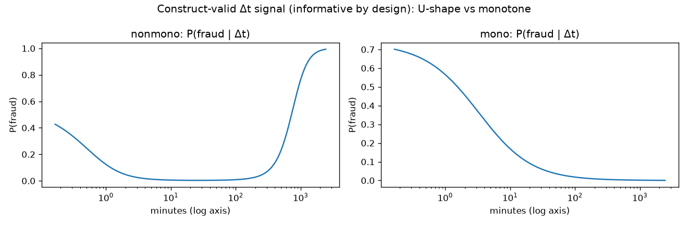
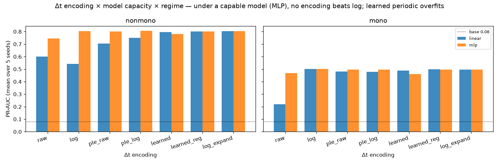
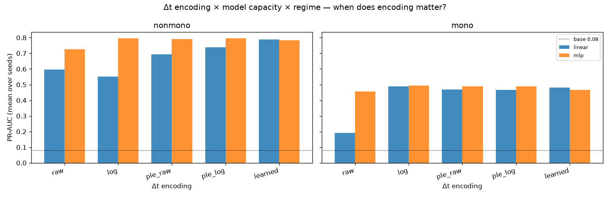
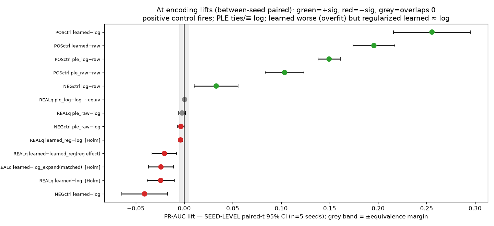

# Encoding Inter-Transaction Time for Fraud Detection: A Capacity-Conditioned Comparison

## Abstract

For an informative, non-monotone inter-transaction-time feature (Δt) under a capable model, no learnable encoding beats the standard `log1p` transform on the primary metric, PR-AUC. On synthetic data where Δt is informative by construction, a strong model (MLP) sees `ple_log − log` = +0.000 PR-AUC (seed-level paired 95% CI [−0.002, +0.002]), which lies entirely within a ±0.005 equivalence margin and therefore establishes PLE-on-log as equivalent to `log`; standard PLE on raw minutes shows no detectable gain (`ple_raw − log` = −0.002 [−0.006, +0.001], p=0.148); and an unregularized learned periodic basis is significantly worse (`learned − log` = −0.024 [−0.038, −0.010], p=0.009, Holm-significant), a deficit attributable to overfitting that a weight-decay arm largely recovers (`learned_reg − log` = −0.004 [−0.006, −0.002]). The null is powered: a pre-registered positive control fires decisively on a weak (linear) model (`learned − log` = +0.256 [+0.216, +0.295]; `learned − raw` = +0.196 [+0.174, +0.217]). The recommendation is to keep Δt as a `log1p`-transformed per-step input in the reference GRU, a prudent cost-asymmetry default under acknowledged transfer uncertainty; the binding open question is that the MLP-to-GRU transfer is assumed, not measured, and is resolved by a one-line reference-model encoding-swap A/B.

## Background

The reference model is a sequence model (GRU) over roughly 300-step transaction histories in which SHAP attribution identifies inter-transaction time (Δt) as a highly important feature. The engineering decision driving this study is how to *encode* that per-step Δt input: keep the standard `log1p`-of-minutes transform, or adopt a richer numeric encoding. Two candidate families motivate the question. Piecewise-linear encoding (PLE) expands a scalar into a quantile-bin basis (the Gorishniy et al. tabular-DL form); periodic/PLR encoding expands it into a learned Fourier basis. Both are documented to improve *non-recurrent* tabular deep networks on heterogeneous feature sets. Whether they help a capable recurrent model on a single informative numeric feature is the open question, and the prior literature does not answer it: the published gains scope to a different model class and a different feature regime. This negative result is therefore scoped accordingly, not a blanket claim that learned numeric embeddings do not help.

A central design constraint follows from a basic validity requirement: comparing *encodings* of a feature carries evidential weight only if the feature is informative. If Δt-only performance sat at the base rate, no encoding could matter and a null would be vacuous. The study therefore makes Δt informative by construction and builds in a positive control, so that a null result is a real measurement of "no gain" rather than an artifact of a dead feature. The construct-valid synthetic setting is the test itself, because real-world data is not accessible in this environment; the synthetic generator is designed so that Δt carries strong, non-monotone signal that any adequate encoding can expose.

## Methods

### Hypothesis (final form)

The pre-registered claim is capacity-conditioned and three-part. For an informative Δt feature whose fraud risk is non-monotone in Δt (short Δt = card-testing burst and long Δt = dormant-account reactivation are both high-risk; medium Δt is low-risk):

1. **Positive control.** A weak (linear) model cannot fit the non-monotone shape from `raw` or `log` Δt, so richer encodings (PLE and learned periodic) beat both. If this fails, the design has no power and the run halts (a hard precondition gate).
2. **The real question.** A strong (MLP) model learns the non-monotone transform from `log` itself, so richer encodings do not beat `log` (the capacity argument).
3. **Negative control.** In a monotone Δt regime, `log` already suffices: richer encodings do not beat it, and `log ≥ raw`.

### Data construction

Synthetic Δt is generated as minutes = exp(latent), giving an always-positive, heavy-tailed distribution with no clipping artifact. The two derived inputs are `raw` (standardized minutes) and `log` (standardized log1p-minutes). Fraud risk is a logit-linear function of a Δt-derived signal plus one mild Gaussian co-feature, with the intercept calibrated to a target positive rate of 0.08; the realized empirical positive rate after calibration and sampling is approximately 0.072. The non-monotone regime makes risk U-shaped in the log scale; the monotone regime is the linear control. Train and test sets are 9,000 rows each, regenerated per seed. All scalers and PLE bin edges are fit on training data only (causal-style), avoiding test-set leakage. The fitted fraud-vs-Δt response shapes are shown in Figure 1.

*Figure 1. The construct-valid Δt signal. Non-monotone (U-shaped) and monotone fraud-vs-Δt response curves used by the generator.*

### Encodings and capacity control

Seven encodings are compared: `raw`, `log`, `ple_raw` (standard PLE quantile bins on raw minutes), `ple_log` (PLE on log1p-minutes), `learned` (periodic PLR on the standardized log scale, σ=2.0, unregularized), `learned_reg` (the same periodic basis with weight decay 1e-3), and `log_expand` (a matched-capacity, non-periodic learnable expansion). Two capacities are used: a linear head and an MLP head (one 48-unit ReLU hidden layer). The capacity confound is deliberate and load-bearing rather than hidden: on the linear row the basis encodings carry more parameters, which *is* the positive-control mechanism (a basis lets a linear head bend the U-shape). The capacity-controlled comparison is the MLP row, where every arm shares the same MLP capacity, so any difference there is attributable to the encoding, not to model expressiveness. Two further arms isolate competing explanations of any learned deficit. `log_expand` matches the learned basis's added capacity with a non-periodic expansion, to separate "a periodic basis is harmful" from "any extra expansion is harmful." `learned_reg` adds weight decay, to separate "the periodic basis overfits" from "the periodic basis is fundamentally unsuited."

### Metric and uncertainty

The primary metric is PR-AUC (average precision), appropriate to the ~8% imbalanced fraud-like base rate. Each cell is trained over 5 seeds (Adam, lr=1e-2, 500 epochs). Reported PR-AUC point estimates are 5-seed means.

Decision verdicts use **seed-level** paired uncertainty, the deployment-relevant between-run variance. For each pre-specified pair, the 5 per-seed paired PR-AUC differences yield a paired-t 95% confidence interval and p-value. This is the correct uncertainty for a deployment decision because run-to-run variation (different data draw plus different initialization) is what a re-trained reference model experiences; within-seed evaluation-set resampling is not. A secondary within-seed bootstrap on seed 0 (1,000 resamples of the test rows of a single trained model) is retained only as a labeled diagnostic of evaluation-set noise; it is not the decision bar and is systematically tighter than the seed-level CI because it holds the trained model and training draw fixed. The seed-0 bootstrap additionally shares a single RNG stream across all pairs, so its per-pair intervals are not independent draws; this does not bias any single interval but reinforces its secondary status.

"PLE ties log" is stated as an **equivalence** claim with a pre-specified margin of ±0.005 PR-AUC: an arm is declared equivalent to `log` only when its seed-level CI lies entirely within ±0.005, which excludes any practically meaningful gain. An arm whose CI includes zero but is not contained in the margin is reported as "no detectable gain," not as equivalence. Multiplicity over the non-monotone-MLP decision family (the five `*_minus_log`/matched lifts that drive the verdict) is controlled with the Holm step-down procedure.

A hard precondition gate guards construct validity before any encoding verdict is read: Δt must be informative, asserted by the Δt-only MLP PR-AUC sitting far above the base rate. The realized values confirm it (Δt-only MLP PR-AUC ≈ 0.80 ≫ 0.08; a co-feature-only "z-only" floor of 0.100 for the linear head and 0.0997 for the MLP, at the base rate), establishing that Δt is the dominant signal and the feature is alive.

## Results

The results are organized by the three research questions the pre-registration poses. Every quantitative claim carries its seed-level paired 95% CI; PR-AUC values are 5-seed means.

### PR-AUC by encoding

Table 1 reports the primary metric (5-seed-mean PR-AUC) for every encoding under both capacities in the non-monotone regime. The summary across regimes and capacities is shown in Figure 2; the per-cell detail is in Figure 3.

**Table 1. PR-AUC by encoding (5-seed mean; non-monotone regime; base rate target 0.08, realized ≈ 0.072).**

| Encoding | linear (weak) | MLP (strong) |
|---|---|---|
| raw | 0.601 | 0.744 |
| **log** | 0.541 | **0.804** |
| ple_raw (standard PLE) | 0.705 | 0.802 |
| ple_log (PLE on log) | 0.750 | 0.805 |
| learned (periodic PLR, σ=2.0) | 0.797 | 0.780 |
| learned_reg (periodic + weight decay) | 0.802 | 0.801 |
| log_expand (matched, non-periodic) | 0.805 | 0.804 |

The linear column and the MLP column tell opposite stories, which is the capacity argument made visible: a rich basis is decisive for a weak model and inert-or-harmful for a capable one.

*Figure 2. Primary-metric summary. 5-seed-mean PR-AUC for every encoding, capacity, and regime.*

*Figure 3. Per-cell PR-AUC. The non-monotone MLP row is the capacity-controlled decision row.*

Table 1 reports 5-seed-mean PR-AUC; the lifts in Table 2 are computed at the seed level (paired across the 5 seeds). The two quantities are computed differently, so a lift does not equal the exact difference of two Table 1 cells.

### Research question 1: Is the null powered? (positive control)

The positive control fires decisively. On the weak linear head over the non-monotone shape, a basis rescues a model that cannot otherwise bend the U-shape: `learned − raw` = +0.196 [+0.174, +0.217], `learned − log` = +0.256 [+0.216, +0.295], `ple_log − raw` = +0.149 [+0.138, +0.161], and `ple_raw − raw` = +0.104 [+0.084, +0.124], all CI-separated from zero (p ≤ 1.5e-4). A weak model genuinely cannot fit the non-monotone Δt response from `raw` or `log`, and a basis supplies what it lacks. The null on the MLP row is therefore a real measurement, not a vacuous one: the design has the power to detect a gain of this kind where one exists.

### Research question 2: Does a richer encoding beat `log` for a capable model? (the real question)

It does not. On the capacity-controlled MLP row in the non-monotone regime:

- **PLE-on-log is equivalent to `log`.** `ple_log − log` = +0.000 [−0.002, +0.002], with the CI contained in the ±0.005 equivalence margin. This is positive evidence of no meaningful gain, not mere failure to reject.
- **Standard PLE-on-raw shows no detectable gain.** `ple_raw − log` = −0.002 [−0.006, +0.001], p=0.148. The CI includes zero but is not contained in the margin, so this is "no detectable gain" rather than a formal equivalence; either reading licenses non-adoption, since PLE adds only bins and edges for no measured benefit.
- **The unregularized learned periodic basis is significantly worse.** `learned − log` = −0.024 [−0.038, −0.010], p=0.009, Holm-significant. The deficit survives the matched-capacity control: `learned − log_expand` = −0.024 [−0.037, −0.011], p=0.007, Holm-significant, so the harm is specific to the learned basis as configured, not a generic cost of added expansion (the non-periodic `log_expand` itself ties `log` at 0.804).

The seed-level lift verdicts are summarized in Table 2 and visualized in Figure 4.

**Table 2. Seed-level paired-t lifts (n=5 per-seed paired diffs; 95% CI; * = CI excludes 0; H = Holm-significant within the decision family; ≡ = equivalent to log within ±0.005).**

| Pair | Model | Regime | Lift | 95% CI | p | Flags |
|---|---|---|---|---|---|---|
| ple_raw − log | MLP | nonmono | −0.002 | [−0.006, +0.001] | 0.148 | — |
| ple_log − log | MLP | nonmono | +0.000 | [−0.002, +0.002] | 0.579 | ≡ |
| learned − log | MLP | nonmono | −0.024 | [−0.038, −0.010] | 0.009 | * H |
| learned_reg − log | MLP | nonmono | −0.004 | [−0.006, −0.002] | 0.005 | * H |
| learned − log_expand | MLP | nonmono | −0.024 | [−0.037, −0.011] | 0.007 | * H |
| learned − learned_reg | MLP | nonmono | −0.020 | [−0.033, −0.008] | 0.011 | * |
| learned − raw | linear | nonmono | +0.196 | [+0.174, +0.217] | <0.001 | * (pos ctrl) |
| log − raw | MLP | mono | +0.033 | [+0.010, +0.056] | 0.016 | * (neg ctrl) |
| learned − log | MLP | mono | −0.041 | [−0.064, −0.017] | 0.008 | * (neg ctrl) |

*Figure 4. Seed-level lift forest. Paired-t 95% CIs over 5 seeds. The decision-driving non-monotone MLP lifts are small; the positive-control lifts (off-scale large) confirm power.*

The decision-driving effects are small and rest on 5 seeds, so the seed-level CIs are wide. They are reported as the honest uncertainty available from a 5-seed study; the positive control and the `learned − log` verdict survive Holm adjustment over the decision family, and more seeds would tighten the intervals.

### Research question 3: Is the learned deficit overfitting? (mechanism)

The deficit is overfitting, verified rather than asserted. Two pre-specified pieces of evidence establish it. First, the 5-seed-mean training loss shows the unregularized learned arm fits the training set *better* than `log` while scoring *worse* on test: learned train loss 0.096 < log 0.108, the canonical overfitting signature (lower train, higher test deficit). Second, regularization recovers most of the deficit. The weight-decay arm closes the gap to `learned_reg − log` = −0.004 [−0.006, −0.002] (5-seed-mean train loss 0.106 ≈ log's 0.108, i.e. the over-fit is suppressed), and the regularization effect itself is significant: `learned − learned_reg` = −0.020 [−0.033, −0.008], p=0.011. Weight decay removes roughly 85% of the unregularized deficit, which identifies the mechanism as overfitting of the σ=2.0 periodic basis, not a fundamental property of a basis. Consequently "learned is *worse*" is specific to the unregularized σ=2.0 configuration, while "no learnable basis *beats* log for a capable model" is the robust finding across the periodic, regularized-periodic, and matched non-periodic arms.

### Negative control

In the monotone regime, `log` suffices. `log − raw` = +0.033 [+0.010, +0.056] (log beats raw), PLE ties (`ple_raw − log` ≈ −0.003), and the learned basis is again worse (`learned − log` = −0.041 [−0.064, −0.017]). The negative control is clean.

### Verdict summary

All three pre-registered claims are confirmed. The positive-control claim holds (richer encodings beat raw/log for a weak model on non-monotone Δt; the test has power). The real-question claim holds (PLE does not beat log for a capable model — equivalent on log, no detectable gain on raw — and the learned periodic basis is worse, by overfitting recovered under regularization; no learnable basis beats log). The negative-control claim holds (log suffices for monotone Δt).

## Limitations

Each limitation is a structural property of the design, stated as threat, evidence on its magnitude, and mitigation.

**Architecture transfer (MLP to GRU).** *Threat:* the recommendation targets a recurrent reference model, but the capacity-controlled comparison uses an MLP on a single scalar Δt. A GRU consumes a *sequence* of per-step Δt values and its recurrence could exploit a basis through cross-step interactions an MLP cannot, so "a capable model learns the transform from log" is an architecture assumption for the recurrent case, not a demonstrated fact. This is the binding limitation. *Evidence on magnitude:* the capacity argument predicts the same outcome and is consistent across every arm and both control regimes, but no recurrent arm was run, so the magnitude of any GRU-specific deviation is unquantified. *Mitigation:* the recommendation is gated behind a definitive reference-model test — a one-line per-step encoding swap (log → PLE / learned) in the reference GRU, where SHAP confirms Δt is important — to be run before any change, with the CI-excludes-zero bar as the adoption criterion.

**Operational cost claims are expectations, not measurements.** *Threat:* the rationale for preferring `log` cites lower inference cost, simpler retraining and drift handling, and a "silent degradation" risk for the learned basis; none of these latency or serving properties were benchmarked here. *Evidence on magnitude:* they are reasoned consequences of the encodings' structure (`log` is parameter-free and edge-free; PLE adds versioned quantile edges and per-step preprocessing across ~300 steps; a learned basis adds trainable parameters and a σ hyperparameter), but no profiling was run. *Mitigation:* these claims are labeled as engineering expectations throughout, distinct from the measured accuracy findings, and the accuracy result alone (no gain) is sufficient to support non-adoption independent of the cost argument.

**Statistical precision is bounded by 5 seeds.** *Threat:* the decision-driving effects are small, so the seed-level paired CIs are wide and a 5-seed study cannot resolve sub-±0.005 differences with high confidence. *Evidence on magnitude:* the key verdicts (positive control, `learned − log`, `learned_reg − log`, `learned − log_expand`) survive Holm adjustment over the decision family, and the equivalence verdict for `ple_log` holds within the ±0.005 margin; the borderline cases are exactly the small effects most exposed to the seed count. *Mitigation:* the seed-level paired-t bar is the deployment-relevant uncertainty (not the tighter within-seed bootstrap, which is reported only as a secondary diagnostic), multiplicity is Holm-controlled, and additional seeds would narrow the intervals.

**Single synthetic, symmetric U-shape.** *Threat:* the study conditions on one smooth symmetric non-monotone response; a real Δt response that is multi-modal or has a sharp threshold could favor a basis that `log` smears. *Evidence on magnitude:* for the family of smooth non-monotone shapes a harder or asymmetric shape only reduces the structure a basis can exploit relative to what `log` already captures, so the no-gain conclusion is conservative within that family; the conjecture does not extend to arbitrary shapes. *Mitigation:* the claim is scoped to smooth non-monotone responses and the reference-model A/B would surface any real-shape gain before adoption.

**Additive single co-feature.** *Threat:* the generator combines one mild Gaussian co-feature additively with the Δt signal, so the study cannot speak to Δt-by-other-feature interactions (e.g., Δt with amount or velocity), which is precisely where a per-step learned basis inside a GRU might earn its keep. *Evidence on magnitude:* the additive design isolates the encoding question cleanly but removes the interaction regime entirely, so its effect is unmeasured. *Mitigation:* this bounds the external validity of "spend budget on signal, not representation" to the no-interaction case and is flagged as the most likely place a recurrent learned basis could differ.

**Prior-art scope.** *Threat:* PLE/PLR are documented to help non-recurrent tabular deep networks on heterogeneous features (Gorishniy et al.), so a blanket reading of this negative result would contradict the literature. *Evidence on magnitude:* the published gains are in a different model class and feature regime; this study measures a single informative numeric feature under a capable model. *Mitigation:* the result is explicitly scoped to that setting and does not claim learned numeric embeddings are unhelpful in general.

**Minor disclosures.** The base rate is target 0.08 / realized ≈ 0.072 after intercept calibration. The seed-0 within-seed bootstrap shares one RNG stream and is a secondary diagnostic only. The learned-frequency spectrum (seed 0, spanning ≈0.2–4.3) is illustrative color consistent with high-frequency components fitting noise, not independent evidence. Table 1 cells are 5-seed means while Table 2 lifts are seed-level paired, so the two are not arithmetically reconstructable from each other.

## Conclusions and Recommendation

The evidence establishes one robust finding: for an informative, non-monotone Δt feature under a capable model, no learnable encoding beats `log`. PLE-on-log is equivalent to `log` within a ±0.005 margin, standard PLE-on-raw shows no detectable gain, and an unregularized learned periodic basis is significantly worse through verified overfitting that regularization largely recovers — and even the regularized and matched non-periodic expansions only tie `log`. The finding is powered: the positive control fires decisively on a weak model, so the MLP-row null is a real measurement of "no gain." The capacity argument is the portable takeaway: a basis is decisive for a weak model and inert-or-harmful for a capable one, because a capable model already learns the Δt-to-fraud transform from the standard `log` input.

**Recommendation: keep Δt as a `log1p`-transformed (log1p-minutes) per-step input in the reference GRU. Do not adopt PLE or a learned periodic basis for Δt.** This is a prudent cost-asymmetry default under acknowledged transfer uncertainty, not proven dominance of `log` for the reference GRU. Its evidentiary basis is the robust "no encoding beats log for a capable model" result, which holds across the seed-level CIs, the equivalence test, the regularized arm, and the matched expansion; combined with the operational expectation that `log` is the cheapest and simplest option to serve, retrain, and monitor, there is no measured accuracy reason to pay the added complexity of PLE or a learned basis. The main risk is the architecture-transfer gap: the reference GRU over ~300-step Δt sequences was not directly tested, and a recurrent model could in principle exploit a basis through cross-step interactions the MLP cannot. That risk is resolved decisively and cheaply by the reference-model encoding-swap A/B (log → PLE / learned, one line per step, where SHAP confirms Δt matters), to be run with the CI-excludes-zero adoption bar before any change. Until then, model-improvement budget is best spent on signal (amount, velocity, balance) and tuning, not on Δt representation.

## Artifacts

- `TECHNICAL_REPORT.md` — this publication-voice results report.
- `CONCLUSIONS.md` — primary results and framing: headline, seed-level lift table, interpretation, peer-review-calibrated caveats, and hypothesis closure.
- `REPORT_ADDENDUM.md` — reference-model re-evaluation: the `log1p` recommendation as a prudent cost-asymmetry default, with operational claims marked as expectations and the GRU A/B as the definitive test.
- `HYPOTHESIS.md` — pre-registered three-part capacity-conditioned claim, expected observables, and the hard precondition gate.
- `stats_results.json` — authoritative numbers: per-cell 5-seed-mean PR-AUC and seeds, seed-level paired-t lifts (mean/CI/p/Holm/equivalence), secondary seed-0 bootstrap fields, z-only floor, 5-seed-mean convergence train losses, equivalence margin (0.005), weight decay (1e-3), base rate target (0.08).
- `dt_encoding_experiment2.py` — analysis script: data generator, seven encodings, two capacities, seed-level paired-t and Holm machinery, secondary seed-0 bootstrap, convergence and precondition checks.
- `dt_encoding_poc.py` — proof-of-concept synthetic Δt-encoding grid (writes `fig_dt_shapes.png`, `fig_dt_prauc.png`).
- `PEER_REVIEW_R1.md` — peer review whose remediation (seed-level statistics, equivalence framing, earned-overfitting arm, cost-asymmetry reframing) is applied throughout this report.
- `fig_dt_shapes.png` — fraud-vs-Δt response shapes (Figure 1).
- `fig_summary_prauc.png` — PR-AUC summary across encodings, capacities, regimes (Figure 2).
- `fig_dt_prauc.png` — per-cell PR-AUC detail (Figure 3).
- `fig_lift_forest.png` — seed-level paired-lift forest plot (Figure 4).
