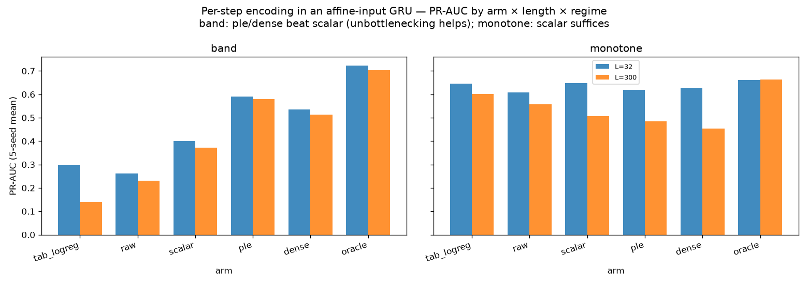
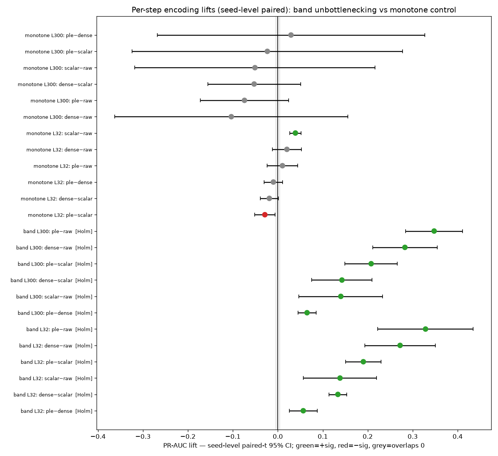

# When Does a Learned Numeric Encoding Help? A Capacity-of-the-Input-Path Account (synthetic studies)

## Abstract

Across four tested numeric encodings (`raw`, `log`, `ple` = quantile piecewise-linear, and `dense` = a learned per-feature nonlinear expansion), whether `ple` or `dense` beat a plain `log` transform tracked, in these experiments, one property of the model: whether it applies a free nonlinearity to the feature on its own before mixing it with the rest. Two controlled synthetic experiments on fraud-relevant numerics (transaction amount, inter-transaction time Δt), judged by PR-AUC with seed-level paired-t 95% CIs, illustrate the two cases. In a static model with a free per-feature nonlinearity (an MLP), the only measured gap was conditioning: `log` > `raw` (+0.06 PR-AUC), while neither `ple` nor `dense` beat `log` (CIs overlapping zero, or within a ±0.005 equivalence margin). In a sequence model whose per-step numeric input is read affinely (a GRU, the property the reference model shares), the four-way ranking was `raw` < `log` < `dense` < `ple`, each step CI-separated and Holm-significant (`ple − log` +0.19 to +0.21, `dense − log` +0.13 to +0.14, `ple − dense` +0.06 to +0.07, `log − raw` +0.14), at sequence lengths 32 and 300. The same four encodings ranked differently in the two settings. The next section proposes a mechanism consistent with both, and the Limitations note what it does and does not establish.

## The proposed mechanism

A model consumes a scalar feature `x` through a per-feature map `e(x)`, then does something with the result. The four encodings differ in what `e` supplies: `raw` is the bare value, `log` a monotone rescale, `ple` a fixed localized (band-capable) basis, `dense` a learned nonlinear expansion. On this account, whether the richer two (`ple`, `dense`) beat `log` depends on what function of `x` the model can already form on its own.

- **Free-nonlinearity path.** If the model applies an arbitrary nonlinear network to `x` (an MLP head, or any universal approximator on the scalar), then for any invertible `e` the composition can absorb `e⁻¹`: *asymptotically* `{MLP(e(x))} = {MLP(log x)}`. A richer basis is then expected to be largely redundant for such a model, leaving conditioning (`log` vs `raw`) as the main lever. This is an asymptotic argument; the finite-model evidence below is what is actually tested.
- **Affine-read path.** A GRU reads each per-step input only as `W·e(x_t)` inside its gates, before the fixed sigmoid/tanh. It does not apply a free nonlinear network to `x_t` alone. The per-step function class available at the input is the span of the encoding: `log` gives one monotone shape, `ple` a localized band-capable basis, `dense` a learned expansion. A richer `e` therefore widens that class. The recurrence can still synthesize some per-step non-monotonicity through gate-state products, so this is an efficiency or expressiveness difference, not a strict impossibility.

**Predictions (tested below).** For a free-nonlinearity model: `raw` < `log`, with `ple` and `dense` not beating `log`. For an affine-read model: `ple` and `dense` above `log`, and, if the fixed basis avoids an optimization burden the learned one carries, `ple` at or above `dense`. Both experiments use synthetic data where the feature is informative by construction, with a positive control (to confirm the test has power) and a precondition gate (to confirm real signal). PR-AUC is the metric, and seed-level paired-t 95% CIs with Holm the decision rule.

## A case where the richer encodings did not help: a free-nonlinearity model

**Setting.** Δt, informative and non-monotone by construction, under an **MLP** head, which supplies the free per-feature nonlinearity the account emphasizes. A weak **linear** head serves as the power control.

**The power control fires.** On the linear head, which cannot bend the non-monotone shape from a scalar, a basis produces a large lift (basis-vs-`raw` = +0.196 [+0.174, +0.217]). The apparatus detects an encoding effect when one is present, so the MLP results below are interpretable measurements rather than absence of power.

**For the capable model, the only measured gap is conditioning.** Four-way PR-AUC under the MLP (non-monotone Δt, 5-seed mean):

| Encoding | MLP PR-AUC | vs `log` |
|---|---|---|
| `raw` | 0.744 | −0.060 (conditioning gap) |
| **`log`** | **0.804** | baseline |
| `ple` | 0.802 | −0.002 [−0.006, +0.001], no detectable gain |
| `dense` | 0.804 | ≈ 0.000, ties |

`log` beats `raw` by +0.06 (the heavy tail hurts a finite model), but once the feature is on a sensible scale, neither `ple` nor `dense` beat `log` here. That is consistent with the MLP forming the needed transform itself. A learned-periodic variant did slightly worse than `log` (−0.024, with lower training loss and worse test PR-AUC, consistent with overfitting). The pattern matches the prediction for this regime: `raw` < `log`, and `ple` ≈ `dense` ≈ `log`.

*Figure A1. The linear column shows a basis helps a weak head substantially. The MLP column shows `log`, `ple`, and `dense` within noise of each other, with `raw` lower.*

*Figure A2. Seed-level paired lifts. The positive control (far right) confirms power; the capable-model decision lifts sit at or below zero.*

## A case where the richer encodings did help: an affine-input sequence model

**Setting.** The same kinds of numerics (amount, Δt) as per-step inputs to a GRU that reads them affinely, with no per-step nonlinear projection, which is the property the reference model shares. The fraud signal is band-selective, cross-feature, and recency-aggregated, constructed to stress a single affine-read scalar. Arms `raw`, `log` (the reference model's `log`-scalar baseline), `ple`, and `dense` (a learned per-step expansion), measured at both lengths.

**Both richer encodings beat `log`, and the fixed basis ranked highest.** Every band-regime lift is CI-separated and Holm-significant:

| Comparison | L=32 | L=300 |
|---|---|---|
| `ple − log` | **+0.190** [+0.151, +0.230] | **+0.208** [+0.149, +0.266] |
| `dense − log` | +0.134 [+0.114, +0.153] | +0.143 [+0.076, +0.210] |
| `ple − dense` | +0.057 [+0.026, +0.087] | +0.065 [+0.045, +0.085] |
| `log − raw` (conditioning) | +0.138 [+0.057, +0.220] | +0.140 [+0.047, +0.233] |

Four-way PR-AUC ranks **`raw` (0.26/0.23) < `log` (0.40/0.37) < `dense` (0.53/0.51) < `ple` (0.59/0.58)**, each step CI-separated and Holm-significant. `ple` reaches ~80% of an oracle ceiling, and the gains persist at L=300 (the reference model's sequence length). `log − raw` is +0.14 here vs +0.06 in the static model, consistent with conditioning mattering more under an affine read, since a heavy-tailed raw value fed straight into the recurrence is especially damaging. The negative control is clean: in a monotone regime no encoding beat `log`. Two within-experiment results bear on the account. `dense − log` > 0 indicates the affine read limits `log` here: adding a free per-step nonlinearity improves over it. `ple − dense` > 0 shows `ple` ranked above `dense`, consistent with the fixed basis avoiding the optimization the learned one requires (an interpretation, not a separately measured cause).

*Figure B1. `ple` > `dense` > `log` (> `raw`) in the band regime at both lengths; monotone regime roughly flat.*

*Figure B2. Seed-level paired lifts. Band lifts CI-separated and Holm-significant; monotone controls overlap zero.*

## Synthesis

The two rankings side by side:

| Model | ranking over {raw, log, ple, dense} |
|---|---|
| Free-nonlinearity (MLP) | `raw` < `log` ≈ `ple` ≈ `dense` |
| Affine-read (GRU) | `raw` < `log` < `dense` < `ple` |

The two models differ in several ways, among them the property this account emphasizes (whether a free nonlinearity is applied to the feature on its own), and the four-way ranking differs between them. A working account consistent with both results: a richer encoding helped here when the model lacked a free per-feature nonlinearity to rebuild the transform, and did not when the model had one; in the latter case the remaining lever was conditioning (`log` over `raw`). Two observations follow, stated as interpretations of the measured rankings. (1) `ple` and `dense` appear to act as substitutes for a missing per-feature nonlinearity rather than for conditioning: they did not beat `log` for the MLP but did for the affine GRU. (2) Where they helped, `ple` ranked at or above `dense`, consistent with a fixed basis needing no optimization. Architecturally, an affine-input GRU could be given that per-feature nonlinearity either by inserting a per-step `dense` projection or by supplying a `ple` basis; in this study `ple` ranked higher and is cheaper (no learned per-step parameters).

Two caveats on the strength of this synthesis are important enough to flag here, not only in Limitations. The cross-setting contrast is **confounded**: the two settings are different architectures, so it does not isolate a single variable. The cleaner within-experiment evidence is the GRU `dense` arm, which adds a free per-step nonlinearity to the *same* model and improves over `log`, and is the most direct test of the named property. Both experiments are also synthetic; they support the account as an explanation, they do not prove it.

## Limitations

- **The mechanism is a proposed explanation, not a proven one.** It is consistent with both results and with the within-GRU `dense` arm, but two synthetic experiments on two architectures do not establish it as general, and the cross-architecture comparison is confounded.
- **Synthetic data; magnitudes are not real-world estimates.** The experiments are constructed to be informative and powered (positive control plus precondition gate). They bound the *direction* of effects under the tested conditions, not the size of any effect on real fraud. The real-data test is an A/B on the reference model.
- **The affine-input GRU result depends on a constructed signal regime.** The band-selective, cross-feature, recency-aggregated signal is where a per-step basis is expected to help; a monotone signal showed no gain (negative control). Whether real amount/Δt-in-context resemble the band regime is unknown here.
- **`ple`'s ranking is training-sensitive.** Feeding many correlated PLE bins into a recurrent input was unstable in an under-resourced run (large seed variance, a spurious negative lift). The reported result used larger hidden width, more epochs, and a larger early-stopping validation set. This is both a caveat and a deployment note.
- **Conditional on the affine read.** The affine-input result holds while the per-step numeric input is read affinely; adding a per-step projection would change it (that projection is the `dense` arm).

## Recommendation

For a fraud sequence GRU that reads per-step `log`-scalar amount and Δt directly into the recurrence (no per-step projection), `ple` on amount and Δt is **a change worth testing**: in this synthetic setting it ranked above both `log` and a learned per-step `dense`, and it is the cheaper of the two ways to add a per-feature nonlinearity. Validate with an A/B on the reference model over `raw` / `log` / `ple` / `dense`, using the seed-level CI-excludes-zero bar and adequate capacity/epochs for the `ple` arm, and treat the synthetic magnitudes as direction-only. For a model that already applies a free nonlinearity to the feature (an MLP, a per-step projection, a tree ensemble), these experiments give no reason to expect `ple` or `dense` to beat `log`, and a learned basis carries overfitting risk; there, conditioning (`log`) and signal are the better targets.

## Artifacts

- Free-nonlinearity setting: `../dt_encoding_fraud/` (raw / log / ple / dense=learnable-expansion arms; CONCLUSIONS, stats; a secondary `ple`-on-raw-vs-`ple`-on-log split there is not carried into this report).
- Affine-input GRU setting: `../gru_perstep_encoding_fraud/` (raw / log / ple / dense arms; gated Metaflow flow, 4/4 promotion gates, determinism verified).
- Figures (this folder): `figA_strong_static_prauc.png`, `figA_strong_static_lifts.png`, `figB_affine_gru_prauc.png`, `figB_affine_gru_lifts.png`.
- Both studies: PR-AUC primary metric, seed-level paired-t 95% CIs plus Holm, synthetic informative-by-construction signals with positive/negative controls and a precondition gate.

## Appendix: Methods (shared)

### Synthetic generators

**Free-nonlinearity study (static).** A single feature, Δt = inter-transaction minutes, drawn as `minutes = exp(latent)` with `latent ~ Normal(3.0, 1.6)` (always positive, heavy-tailed, no clipping). Fraud risk is set on the standardized log scale `s = std(log1p(minutes))`: the **non-monotone** regime uses a U-shape `g = s²` (short and long Δt both higher-risk), the **monotone** regime uses `g = −s`. Label logit = `2.6·std(g) + 0.6·z` with one mild Gaussian co-feature `z`; the intercept is calibrated to a ~8% positive rate (realized ≈ 0.072). 9,000 train and 9,000 test rows. The four encodings are applied to this one feature under a linear head (weak) and an MLP head (one 48-unit ReLU layer).

**Affine-input GRU study (sequence).** Per-account sequences of length `L ∈ {32, 300}`; each step has amount = `exp(Normal(3.0, 0.9))` and Δt = `exp(Normal(2.6, 1.5))` minutes. The **band** regime defines a per-step match = (amount ∈ [3, 18]) AND (Δt ∈ [0.3, 6]), band-selective in both and a cross-feature conjunction. The sequence score is a recency-weighted (leaky-integrator, decay 0.97) sum of matches, chosen so the cross-step aggregation is GRU-tractable at any length (a total count would instead test long-range counting capacity). The **monotone** regime uses score = mean `log1p(amount)`. Label logit = `2.8·std(score)`, intercept calibrated to a ~9% positive rate. Per cell: 4,000 train, 1,200 valid, 3,000 test, regenerated fresh per seed. The encodings feed a shared GRU backbone (hidden 32, Adam lr 0.01, batch 512, at most 30 epochs, early-stopped on validation PR-AUC with patience 6).

### Encodings

`raw` is the standardized raw value. `log` is the standardized `log1p`. `ple` is 16 quantile bins fit on the raw feature (train only), clip-interpolated within each bin. `dense` is a learned per-feature nonlinear expansion (`Linear→ReLU`): in the static study a non-periodic expansion of the `log` scalar; in the GRU study a per-step `Dense+ReLU` applied before the affine recurrence read. All scalers and PLE bin edges are fit on training data only. (The static study additionally ran a learned-periodic variant, which overfit; it is a secondary detail, not part of the four-way.)

### Statistics: seed-level paired-t + Holm

Each cell is trained over **5 seeds**, where a seed sets both the data draw and the initialization, so the estimated variance is run-to-run: the uncertainty a re-trained model experiences. For each pre-specified pair of arms (A, B), the 5 per-seed paired PR-AUC differences `d_s = AP_A(s) − AP_B(s)` are formed (both arms are evaluated on the same seed's data, so the comparison is paired). The reported interval is the paired-t 95% CI, `mean(d) ± t_{.975, 4}·sd(d)/√5`, with the p-value from a paired t-test; a lift is called significant only if its CI excludes zero. "Equivalence to the baseline" is declared only when a CI lies entirely within a ±0.005 PR-AUC margin, which is positive evidence of no meaningful effect rather than mere failure to reject. Multiplicity over the decision family (the band-regime lifts) is controlled with the **Holm step-down** procedure at α = 0.05. A within-seed bootstrap (resampling test rows of one fixed model) is deliberately *not* used for verdicts: it measures evaluation-set noise, not run-to-run variance, and would understate the uncertainty relevant to a decision. With 5 seeds the CIs are correspondingly wide; the reported effects survive that width, but small effects would not be resolvable.

### Controls and gates (shared)

Three pre-registered checks make a null interpretable. A **precondition gate**: a logreg on the true generative score (the "oracle") must reach PR-AUC well above the base rate, indicating the signal is real and learnable, otherwise the run is treated as void. A **positive control**: an arm expected to help if the apparatus has power, namely a basis on the weak linear head in the static study, or the `dense − scalar` lift in the GRU band regime, must be CI-separated. A **negative control**: a monotone regime where the baseline should suffice, where no arm beats it.
